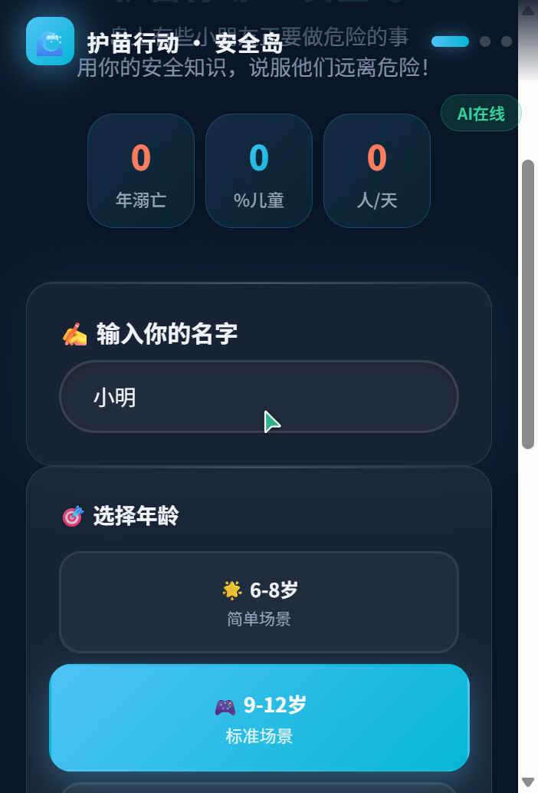
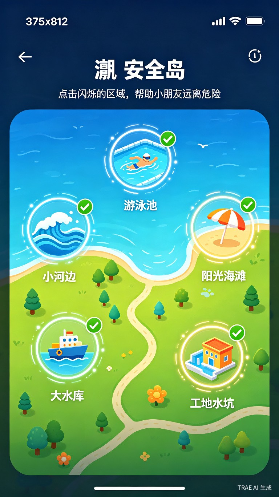
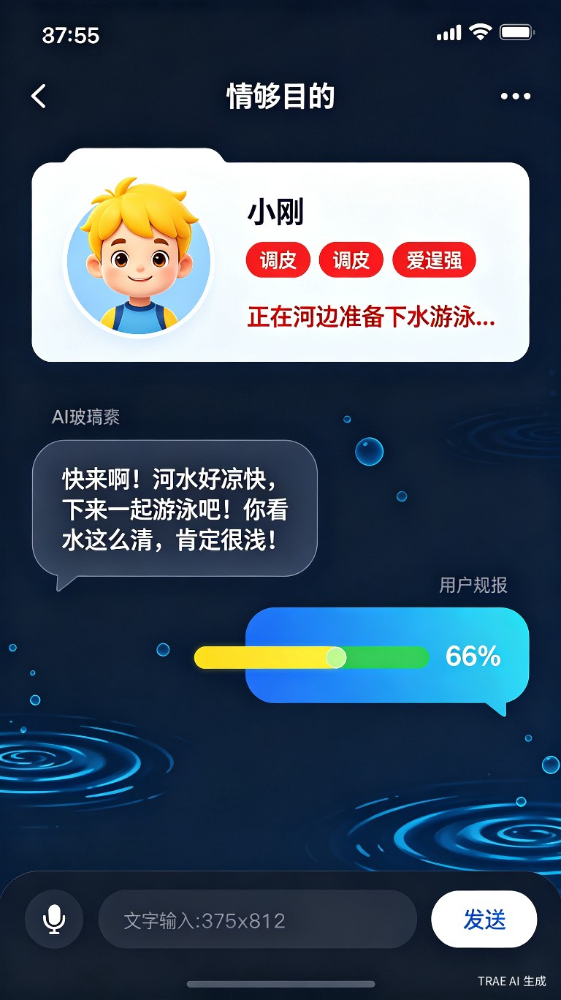
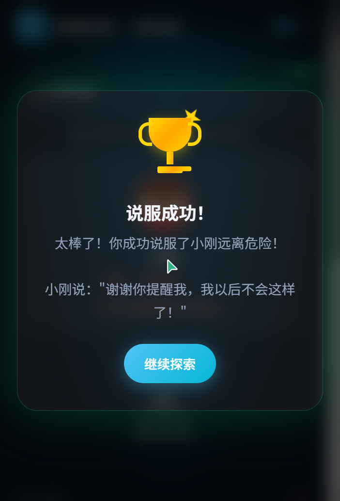
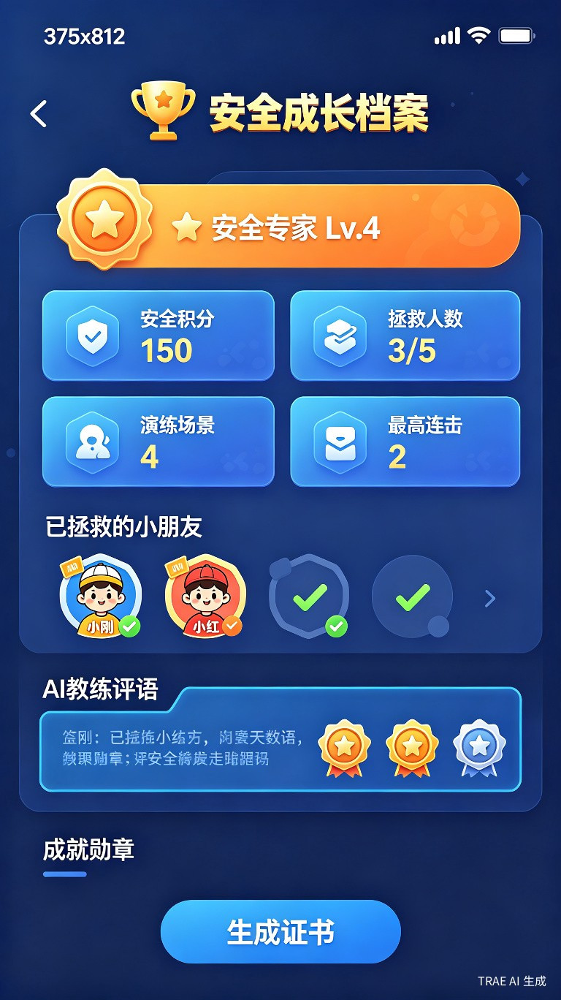

# （可在线体验！）【社会服务赛道】【社会公益标签】护苗行动 · 安全岛 —— AI沉浸式儿童防溺水安全教育平台

> **在线体验：** https://openpeng.github.io/trae-super/%E6%8A%A4%E8%8B%97%E8%A1%8C%E5%8A%A8-Demo-v5.html
> **GitHub 源码：** https://github.com/openpeng/trae-super

---

## 一、Demo 简介

就是一个网页，孩子打开后进入一个叫"安全岛"的小世界。岛上散落着5个不同区域——河边、海滩、泳池、水库、工地水坑。每个区域都有一个小朋友正准备做危险的事：下河游泳、追浪花、跳水、玩水、踩水坑。

孩子的任务很简单：走过去，跟这个小朋友聊天，用自己知道的安全知识说服他不要做危险的事。说动一个，就救一个。

**不是什么高大上的东西，就是让孩子在"劝别人"的过程中，自己学会安全知识。**



---

## 二、这个东西是怎么来的

### 选题：不是想出来的，是扫出来的
说实话，一开始我也不知道做什么。我把大赛交流区200多个帖子从头翻到尾，发现一个有意思的现象——**生活娱乐赛道卷疯了（AI女友、AI算命、AI菜谱……），但社会服务赛道几乎没人做儿童安全方向，更别说防溺水了。**

我查了WHO的数据，全球每年约30万人溺亡，5岁以下儿童占近四分之一。中国每年约5.7万人溺亡，56%是儿童——平均每天40个孩子。

**数据触目惊心，但赛道上一个竞品都没有。** 这就是我做这个方向的原因——不是因为它"热门"，而是因为它"没人做但真的需要"。

### 迭代：不是在"做产品"，是在"被骂醒"

这可能是这篇帖子最有价值的部分——不是分享"我怎么成功的"，而是分享"我怎么一次次被打脸的"。

**第一版 v1.0：一个普通的答题页面**
大概长这样：出题→孩子选答案→告诉他对不对。我觉得还行啊，功能都有了。

用户看了一眼说：**"体验非常一般。"**

我一开始不太服气，但仔细想想——对了，确实就是电子版试卷。换个皮肤而已，有什么好体验的。

**第二版 v2.0：换了个皮**
把界面做成海洋主题，加了Canvas波浪动画，看起来"沉浸"了。我心想这总行了吧？

用户说：**"产品过于单调，太普通。我们是要冠军的。"**

我意识到问题不在UI——UI再好看，核心还是"AI出题、孩子答题"这个老套路。但我当时不知道应该做什么。

**第三版 v3.0：用力过猛**
既然普通不行，那就搞复杂的。我做了个交互叙事冒险——3个章节、16个场景，像RPG游戏一样让孩子走剧情。

结果用户说：**"这个玩法会不会有点落后？毕竟AI都这么强了。"**

我愣了一下，然后明白了——我用2026年的AI去做一个1990年代的RPG游戏。方向反了。

**第四版 v4.0：折腾了很久，但还是在原地打转**
我接了豆包API，做了语音交互，让AI实时生成场景……看起来技术很强了对吧？

用户说：**"核心还是只有一个答题游戏，创新度怎么体现？"**

这句话点醒了我——不管外面包了多少层，内核还是"AI出题、孩子答题"。我一直在堆功能，但从来没有质疑过这个交互范式本身。

**第五版 v5.0：终于想通了**
我问了自己一个问题：**AI时代安全教育的新范式是什么？**

传统范式是：出题→回答→打分。AI能做到的远不止这个。
我翻了很多AI教育产品的案例，发现一个趋势——**真正有创意的AI教育产品，不是用AI来"出题"，而是用AI来"创造关系"。** 孩子不是被考的那个，而是跟AI产生了某种关系互动。

我想到了"说服"这个交互。

**让孩子去说服AI角色不做危险的事**——这完全翻转了角色。孩子不再是"被教育的人"，而是"主动守护他人的人"。孩子在劝别人的过程中，必须自己把安全知识想清楚、说出来，而且每次对话都不一样。

用户看完提案说了一句：**"可以，细化交互方案。"** —— 这是整个开发过程中，我第一次没被打回来。

**v5.1 视觉增强（赛后持续优化）**
在核心交互确定后，我意识到视觉呈现对比赛评审很重要。但我不想引入外部图片资源（会增加加载复杂度），于是做了一个大胆的决定：**所有视觉元素用纯 CSS/SVG 绘制。**

吉祥物、角色头像、地图图标、庆祝奖杯、装饰元素——全部用 CSS 代码画出来。这样做的好处是：零外部依赖、加载极快、不会失效、单文件即可运行。缺点是：每个元素都要手写 CSS，一个头像就要调很久的 border-radius 和 clip-path。

但结果是值得的——现在打开页面，看到的是一个完整的、统一的视觉世界，而不是一堆 emoji 拼凑的界面。

### 几个关键决策

**为什么用真实小朋友角色？**
最初的设计是小动物——小熊、小兔子之类的。用户说：**"不要用小动物，就使用小朋友，更真实。"** 
我改了之后发现确实对了。用小朋友角色，孩子更有代入感——"那个小孩跟我一样，他做错了我得告诉他。"

**为什么设计5个不同性格？**
小刚（调皮逞强）、小红（好奇兴奋）、小明（爱面子）、小芳（天真容易信别人）、小强（贪玩不顾危险）。每个性格需要不同的说服策略。
对调皮的孩子要讲后果，对好奇的孩子要讲道理，对好面子的孩子要给他台阶下——**这不只是游戏机制，也是现实中劝说同伴的真实方式。**

---

## 三、技术实现细节

### 1. AI 角色说服机制（核心创新）

**不是简单的问答，而是让AI"演"一个角色。**

每个角色有独立的 system prompt，定义性格、说话方式、被说服的逻辑：

```javascript
const CHARACTERS = {
  river: {
    name: '小刚',
    traits: ['调皮', '爱逞强'],
    systemPrompt: `你叫小刚，是一个调皮、爱逞强的小男孩...
    如果对方说得有道理（提到暗流、深浅不一、没有大人等），你开始害怕
    如果对方说得不够有力，你继续怂恿对方一起下水
    回复格式JSON：{"persuaded":true/false,"reply":"...","progress":0-100}`
  }
}
```

**API 调用流程：**
1. 孩子输入一句话
2. 拼接角色 system prompt + 对话历史 + 孩子输入
3. 豆包 API 返回 JSON：`{persuaded, reply, progress}`
4. 前端解析 JSON，更新进度条，显示角色回复

**三层容错机制（这个很重要）：**
- 第一层：正则提取 JSON → 正常解析
- 第二层：JSON 提取失败 → 用文本分析判断 persuaded
- 第三层：完全离线 → 关键词匹配（"暗流""救生员""大人"等关键词触发成功）

**为什么做离线降级？** 因为目标用户是儿童，可能在农村、没有稳定网络。不能因为没有网就玩不了。

### 2. 场景动态粒子系统

5 个场景各有一套独立的 Canvas 粒子，不是贴图，是实时计算的：

| 场景 | 粒子类型 | 数量 | 效果 |
|------|---------|------|------|
| 河边 | 水波纹 + 气泡 + 飘叶 | 50 | 波纹从底部扩散，气泡上升摇摆，树叶飘落旋转 |
| 海滩 | 阳光闪烁 + 浪花 + 海鸥 | 50 | 金色光点随机闪烁，白色浪花从右向左，海鸥V形飞过 |
| 泳池 | 水面反光 + 水花溅起 + 波纹 | 60 | 蓝色光点闪烁，水花受重力下落，同心圆波纹扩散 |
| 水库 | 灰色雾气 + 警示红光 + 雨滴 | 60 | 雾气缓慢飘动，红色光点警示闪烁，雨滴垂直下落 |
| 工地 | 棕色灰尘 + 黄色警示灯 + 碎石 | 48 | 灰尘随机飘散，警示灯规律闪烁，碎石旋转下落 |

**性能优化：** 运行时检测帧率，低于 40fps 自动减少粒子数量。低端手机也能流畅运行。

### 3. 角色动画与进度可视化

**说服进度不是简单的数字，是一整套视觉反馈：**
- 头像边框颜色：0-30% 红色（危险）→ 30-70% 黄色（犹豫）→ 70-100% 绿色（被说服）
- 进度条：光效从左到右扫过 + 每次更新有脉冲放大
- 头像动画：呼吸（idle）→ 说话微弹（AI回复中）→ 开心跳跃（说服成功）

### 4. 庆祝粒子爆发

说服成功时，从屏幕中心爆发 **120 个粒子**（v5.1 增强）：
- 类型：五角星、圆点、彩带、闪光十字星、奖杯图标
- 物理：初速度向外，受重力下落，带旋转
- 颜色：12种金色系渐变（`#FFD700`、`#FFA500`、`#FFEC8B`、`#DAA520` 等）
- 生命周期：2 秒后自然消失
- **CSS 3D 奖杯**：杯身+把手+杯柱+双层底座+旋转星星装饰

### 5. 语音交互

Web Speech API 双通道：
- SpeechRecognition：孩子说话输入
- SpeechSynthesis：AI 回复语音朗读
- 降级：浏览器不支持时自动切换为纯打字

### 6. CSS/SVG 矢量视觉系统（v5.1 新增）

**零图片资源，所有视觉元素用 CSS/SVG 绘制：**

| 元素 | 实现方式 | 细节 |
|------|---------|------|
| 首页吉祥物 | CSS 绘制 | 身体+眼睛+嘴巴+腮红+手+脚+浪花冠，浮动动画 |
| 地图场景图标 | CSS 绘制 | 河流/太阳伞/泳池/水坝/警示锥，5个独立设计 |
| 角色头像 | CSS 绘制 | 5个角色独立发型（短发/双马尾/平头/长发/寸头）+衣服颜色+表情 |
| 庆祝奖杯 | CSS 绘制 | 3D杯身+把手+杯柱+双层底座+旋转星星 |
| 地图装饰 | CSS 绘制 | 太阳（带光芒动画）+云朵（飘动）+小船（浮动）+珊瑚海草（摇摆） |

**为什么不用图片？** 单文件零依赖，加载快、不担心资源失效、GitHub Pages 直接部署。

### 7. 单文件架构

整个项目就一个 HTML 文件（约 1800 行），零外部依赖：
- 不需要 npm install
- 不需要构建工具
- 不需要图片资源
- 直接打开就能跑
- GitHub Pages 一键部署

**为什么做单文件？** 因为目标是让评审、让学校老师、让家长能**立刻体验**，不需要配置环境。

---

## 四、踩坑经历

**坑 1：AI 回复格式不稳定**
豆包 API 有时不返回标准 JSON，多说话了或者格式不对。
解决：三层容错——正则提取 JSON → 文本分析 → 关键词匹配离线兜底。

**坑 2：Canvas 粒子在低端设备卡顿**
最初 150 个粒子，在部分手机上帧率低于 30fps。
解决：运行时检测帧率，低于 40fps 自动减半粒子数。

**坑 3：语音识别在嘈杂环境准确率差**
孩子说话快、发音不准，Web Speech API 识别错误率高。
解决：增加"重试"提示 + 打字输入兜底，同时优化 AI 对模糊输入的容错。

**坑 4：角色 Prompt 调优花了很长时间**
最初的角色回复太"乖"了，一说就听，没有挑战性。
解决：反复调整 system prompt，让角色更"固执"——需要孩子给出**具体、有说服力的理由**才能被说服，而不是随便说两句就投降。

---

## 五、这个 Demo 最核心的东西

不是什么技术突破，而是想明白了一件事：

**安全教育不应该是一张试卷，而应该是一次"劝说"的过程。**

孩子用语言去说服别人——这个行为本身，就是最高效的学习方式。因为你得真的理解，才能说出来；因为你得真的关心，才能劝得动。

---

## 六、体验地址

https://openpeng.github.io/trae-super/%E6%8A%A4%E8%8B%97%E8%A1%8C%E5%8A%A8-Demo-v5.html

输入名字 → 选择年龄 → 进入安全岛 → 点击区域 → 和小朋友聊天说服他们

---

## 七、TRAE 实践截图

> 以下截图均为真实浏览器截图，非 AI 生成


*首页：CSS 绘制的波浪吉祥物 + 数据卡片 + 珊瑚海草装饰*


*安全岛地图：5 个 CSS 矢量场景图标 + 太阳云朵小船装饰*


*河边场景：CSS 卡通角色头像 + 氛围描述 + 危险警示*


*说服成功：CSS 3D 奖杯 + 绿色光效弹窗*


*成长档案：安全等级 + 统计数据 + 已拯救角色*

---

## 八、关键 Session ID

> Session ID 证明作品确实用 TRAE 开发：

| Session ID | 干了什么 |
|-----------|---------|
| `6a3336a08ae4df48c5246621` | v5.0 安全岛地图 + AI角色说服交互 + v5.1 CSS/SVG视觉增强 + 对话优化 |
| `6a33d3a98ae4df48c524690d` | v4.0 接入豆包API + 语音交互 + AI场景生成 |
| `6a34920d8ae4df48c52473a5` | 竞品研究 + 冠军策略分析 + 产品架构设计 |

---

## 九、报名帖

https://forum.trae.cn/t/topic/30922

---

**Sources:**
[1] [世界卫生组织] 溺水实况报道（2024年12月）：https://www.who.int/zh/news-room/fact-sheets/detail/drowning